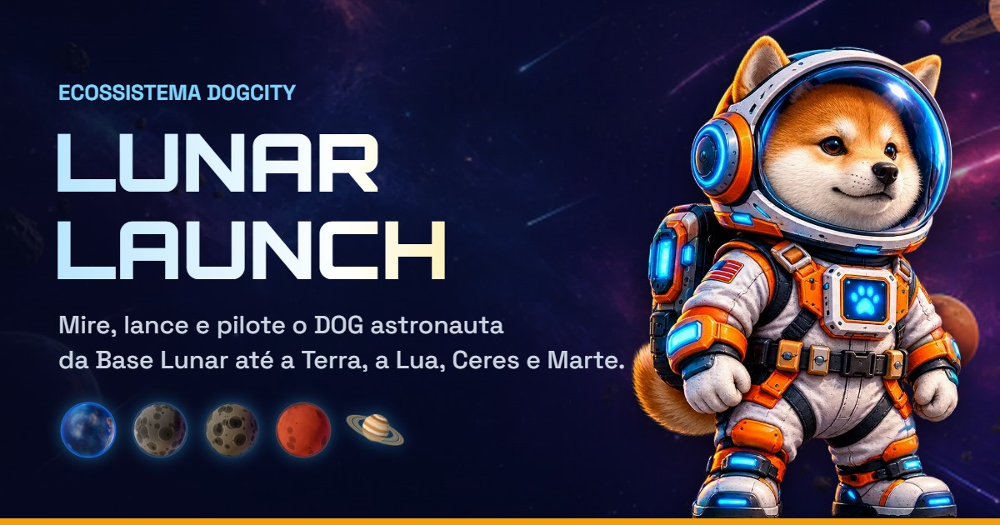

# 🐕‍🦺🚀 DogCity Lunar Launch

**Da Base Lunar DogCity, mire, lance e pilote o DOG astronauta até a Terra, a Lua, Ceres, Marte e Saturno.**

🎮 **Jogue agora:** https://gustavoard18-design.github.io/dogcity-lunar-launch/
Grátis, no navegador (computador ou celular) e instalável como app, em **inglês** (padrão), **português** e **espanhol**. Integrado ao ecossistema DogCity e aos dados on-chain do DOG.




---

## 🎮 Como jogar

Cada missão tem três etapas (no primeiro voo, o **tutorial** guia passo a passo):

1. **Mira**: um ponteiro oscila entre 15° e 80°. Trave-o dentro da faixa verde, que aponta para o planeta de destino no céu (faixa amarela = perfeito).
2. **Força**: uma barra sobe e desce. Trave na zona dourada.
3. **Voo**: pilote com **mouse / toque** ou **WASD / setas**:
   - ✨ **orbes** dão pontos, e sequências sem perder nenhum aumentam o multiplicador (até x5);
   - 💫 **anéis** dão pontos extras e um *boost*;
   - 🛡️ **escudos** absorvem um impacto;
   - ☄️ **asteroides** tiram um ❤️ do casco. Com o casco zerado, a nave é perdida.

Mira e força **perfeitas** começam o voo com escudo. **Espaço/Enter** também travam os medidores; **Esc** cancela antes da decolagem (com reembolso). No fim, **Compartilhar resultado** gera uma imagem do voo para mandar nas redes.

### Score

`score = máx da rota × (30% lançamento + 50% coleta + 20% casco restante)`.
Se a nave for perdida, o voo vale no máximo 60% do que foi feito até ali. Recordes e ranking só contam voos concluídos.

### Rotas

| Rota | Custo (Stardust) | Desbloqueio | Duração | Máx |
|------|------:|:-----------:|--------:|----:|
| Órbita Baixa (Terra) | 10 | nível 1 | 24 s | 100 |
| Mar da Tranquilidade (Lua) | 25 | nível 2 | 30 s | 250 |
| Cinturão de Asteroides (Ceres) | 50 | nível 4 | 36 s | 500 |
| Colônia de Marte | 100 | nível 7 | 42 s | 1000 |
| **Evento da semana** | 25–60 | nível 2–5 | 26–50 s | 350–800 |

O custo é debitado na entrada da missão e só volta se você cancelar **antes** da decolagem (ou se o 3D falhar no aparelho). Quem fica sem Stardust ganha **treino gratuito** na Órbita Baixa, então nunca trava.

### Evento semanal

Toda segunda-feira entra uma rota especial, em rodízio: **Chuva de Meteoros**, **Anéis de Saturno**, **Tempestade Solar**, **Caçada ao Cometa** e **Maratona Marciana**. Cada uma tem ritmo próprio (mais orbes, anéis ou asteroides). Concluir com a qualidade mínima rende um **bônus** uma vez por semana, e o **top 3** do ranking do evento ganha Stardust, Pó Lunar e uma **moldura de nome** exclusiva.

### Progressão

- **Oficina**: 4 atributos com 10 níveis cada. As peças aparecem no foguete 3D.
  - 🔥 Potência: medidores mais lentos e casco extra nos níveis 4 e 8
  - 🎯 Precisão: zonas ideais mais largas
  - 🍀 Sorte: mais orbes e escudos, e ímã de coleta
  - 💨 Manobra: nave mais responsiva
- **Missões diárias**: 3 por dia, sorteadas conforme o seu nível. Dá para trocar uma vez por dia por 25 ✨.
- **Conquistas**: 28 metas permanentes (4 secretas). Cada conquista vira um **título** para o piloto.
- **Molduras de nome**: estilos do nome no perfil e no ranking, desbloqueados por conquistas raras e pelo pódio do evento.
- **Loja**: pelagens, capacetes e rastros do motor. Itens mais raros evoluem a arte do astronauta.
- **Ranking semanal**: geral e do evento, com títulos e molduras.
- **Diário**: carreira do piloto (voos, orbes, anéis, rotas) e histórico.
- **Nome do astronauta**: editável pelo lápis no perfil.
- **Sequência de dias**: recompensa diária num ciclo de 7 dias; 30 dias seguidos liberam a moldura 🔥 Chama Eterna.
- **Temporada do mês**: passe de 10 níveis (10 + score/10 pontos por voo concluído), ranking próprio e moldura exclusiva.
- **Desafio**: no fim do voo, "Desafiar um amigo" gera um link com a mesma sequência de asteroides, orbes e anéis.
- **Guerra de distritos**: carteiras com lote no DogCity somam pontos para o distrito (melhor voo de cada rota por piloto, por semana).
- **Baús DOG** (aba Loja): pagos em DOG, com conteúdo sorteado (chances na tela), limite de 1 por dia e 5 por semana.

---

## 🌐 Idiomas

Inglês é o padrão; o seletor 🌐 (tela inicial e topo do hangar) troca para português ou espanhol. Os textos ficam no código como `L({ en, pt, es })` (`src/lib/i18n.ts`), e o TypeScript exige as três línguas. O idioma é lido ao carregar a página, então trocar recarrega o jogo (voltando ao hangar do mesmo piloto).

## 📱 App e som

- **Instalar como app**: botão no topo (Chrome, Edge e Android) ou, no iPhone, Safari → Compartilhar → Adicionar à Tela de Início. Abre em tela cheia e funciona offline com o que já foi carregado.
- **Trilha sonora** gerada em tempo real (ambiente no hangar, tensão na base, ritmo no voo com o tom do planeta), com botão próprio. O 🔊 silencia tudo.

## 🚀 Rodando

```bash
npm install
npm run dev        # http://localhost:5173 (não envia scores ao ranking online)
npm test           # testes das regras do jogo (Vitest)
npm run build      # typecheck + build de produção em dist/
npm run preview    # serve o build (com service worker)
```

Requer Node 20+ e um navegador com WebGL.

## 🌐 Publicação

Cada push na branch `main` roda typecheck, testes e build no GitHub Actions (Node 22 e 24) e publica o jogo no GitHub Pages (branch `gh-pages`) em cerca de um minuto.

## 🌍 Online (Supabase)

Passo a passo para publicar o backend, checklist do lançamento, suporte e posts prontos: [docs/LAUNCH.md](docs/LAUNCH.md).

- **Login com assinatura** (Edge Function `auth`): ao conectar, a carteira assina uma mensagem de login (BIP-322, grátis, não move fundos; BIP-137 também é aceito). A função confere a assinatura com `bip322-js` e devolve um token de sessão de 30 dias; o banco guarda só o hash (`wallet_sessions`). Convidados recebem um token sem assinatura, preso ao endereço de convidado (que não é um endereço Bitcoin válido, então não serve para se passar por uma carteira). Sem a assinatura, a carteira joga normalmente, mas fica fora do ranking, da loja de baús e da nuvem.
- **Ranking** (geral e do evento): voos concluídos vão para `submit_score_v3` com o token; o endereço vem da sessão, nunca do jogo. Por dentro ele usa `submit_score_v2`, que recusa score acima do máximo da rota, envios em sequência rápida e títulos/molduras fora do padrão. A tabela não é acessível direto pela API. Sem conexão, o jogo mostra o ranking local.
- **Pódio do evento**: `event_leaderboard_v2` devolve o ranking de semanas passadas; o jogo confere ao entrar e entrega o prêmio uma vez.
- **Dados DOG reais** (carteiras Kray, Xverse ou OKX): a Edge Function `dog-balance` consulta as APIs públicas do [DogData](https://www.dogdata.xyz): saldo da Rune DOG•GO•TO•THE•MOON, ranking de holder, selo Genesis e o **lote no DogCity**.
- **Identidade DogData**: a mesma função lê o perfil público do DogData (`/api/profile`): handle e avatar Ordinal (imagem de ordinals.com, com a cópia da UniSat como reserva) e o registro do lote (rua, número, zona, prestígio). Com `?addresses=a,b,c` ela devolve só a identidade de até 25 pilotos para o ranking, com cache de 6 h na tabela `dogdata_identities`.
- **Baús DOG**: a Edge Function `chests` cria o pedido (limite de 1 por dia e 5 por semana, no horário de Brasília), confere o pagamento no DogData (`/api/dog-rune/search-tx`: transação em bloco, saindo da carteira do pedido, com pelo menos o preço em DOG para a tesouraria `bc1qv4q4j8mjxhjxwjuc7vy6sq7c57z6rdvteql4xy`, txid nunca usado) e sorteia o conteúdo no servidor. Preços, chances e limites ficam em `supabase/functions/_shared/chests.json`, lido pelo jogo e pela função. Na Xverse o pagamento sai com um clique (`runes_transfer`); nas outras carteiras o jogador envia e cola o txid.
- **Progresso na nuvem**: carteiras verificadas guardam uma cópia do perfil em `player_saves` (`save_progress` / `load_progress`, só com o token). Cada gravação no aparelho sobe a revisão do perfil; ao entrar vale a cópia com a revisão maior, então o progresso volta num aparelho novo ou depois de limpar o navegador. Os baús pagos também são recreditados pela lista de pedidos pagos da função `chests`.
- **Prêmio acumulado (DOG no voo)**: metade do DOG dos baús pagos forma um prêmio. A Edge Function `dog-drops` sorteia na decolagem (bilhete em `flight_tickets`, ~1 em 150 voos de carteiras verificadas, no máximo 1 moeda por carteira por semana e só os 20 primeiros voos do dia) e reserva o valor; se o piloto pega a moeda, o prêmio vai para `dog_drops` como pendente e é pago pela tesouraria (manual). `jackpot_state` e `recent_dog_drops` alimentam o painel da Loja.
- **Rankings extras**: `district_leaderboard` (guerra de distritos, usa o distrito do cache do DogData) e `season_leaderboard` (temporada do mês).
- **Métricas**: `track_event` grava eventos anônimos (id aleatório por navegador, nunca o endereço) em `analytics_events`; consultas prontas em `supabase/queries/metrics.sql`. Só o jogo publicado envia.
- Migrações SQL e as funções em `supabase/`. Com os segredos `SUPABASE_ACCESS_TOKEN` e `SUPABASE_DB_PASSWORD` no repositório, o workflow **Supabase deploy** publica tudo sozinho a cada push em `supabase/` na `main`. À mão: `supabase db push` e `supabase functions deploy <auth|chests|dog-balance> --no-verify-jwt`.
- **Monitoramento**: o workflow **Health check** roda `scripts/health-check.mjs` a cada hora (site, rankings, `dog-balance`, `chests`, `auth`) e abre o chamado "Health check falhou" quando algo cai. A URL e a chave publicável ficam em `src/lib/online.ts` (ou `VITE_SUPABASE_URL` / `VITE_SUPABASE_KEY`, ver `.env.example`).
- Limitação: o jogo roda no navegador, então as regras barram scores impossíveis e envios em nome de outra carteira, mas não impedem que alguém altere o código para mandar scores altos (dentro do máximo da rota) da própria carteira.

## 🔗 Carteira

- **Jogar agora** cria um piloto convidado com endereço único, salvo no navegador (saldo DOG simulado).
- **Carteiras**: Kray, Xverse e OKX (via `window.krayWallet` e `@sats-connect/core`). O jogo usa o endereço Taproot/Ordinals e pede uma única assinatura de login (grátis, sem mover fundos). A patente usa o saldo DOG real.
- **No celular**: sem extensão, Xverse e OKX mostram **Abrir no app**, que abre o jogo no navegador interno da carteira (links universais de cada uma).

## 📁 Estrutura

```
src/
├── App.tsx               # telas (conexão, hangar, missão) e ações do jogador
├── game/                 # a missão jogável
│   ├── LaunchGame.tsx    # fases, HUD, entrada e tutorial
│   ├── PadScene.tsx      # plataforma, mira, contagem e decolagem (3D)
│   ├── LaunchSite.tsx    # Base Lunar: relevo, crateras, construções
│   ├── FlightWorld.tsx   # simulação do voo: asteroides, orbes, anéis, câmera
│   └── ResultScreen.tsx  # resultado e compartilhamento
├── three/                # peças 3D
│   ├── RocketModel.tsx   # foguete Bitcoin (modelo gerado) com o DOG na escotilha
│   ├── Rocket.tsx        # chama, peças da Oficina e casco de reserva
│   ├── DogModel.tsx      # DOG astronauta 3D (modelo gerado)
│   ├── DeepSpace.tsx     # rochas gigantes e satélite no fundo do voo
│   ├── Planet.tsx, rocks.ts, textures.ts, Particles.tsx, SpaceBits.tsx
├── components/           # painéis do hangar
└── lib/                  # regras puras (testadas) e serviços
    ├── economy.ts, stats.ts, scoring.ts, progress.ts, shop.ts, evolution.ts
    ├── missions.ts, events.ts, achievements.ts, frames.ts, podium.ts, tutorial.ts
    ├── storage.ts        # localStorage + migração de perfis antigos
    ├── online.ts         # ranking e dados DOG (Supabase)
    ├── wallet.ts         # convidado / Kray, Xverse, OKX
    ├── audio.ts, music.ts  # efeitos e trilha sintetizados (WebAudio)
    ├── i18n.ts           # idiomas (en/pt/es) e o helper L()
    ├── challenge.ts, rng.ts   # desafio por link e sorteios do voo com semente
    ├── streak.ts, seasons.ts, districts.ts  # sequência, temporadas, guerra de distritos
    ├── chests.ts         # baús DOG (pedido, pagamento, crédito)
    ├── analytics.ts      # métricas anônimas
    ├── shareCard.ts      # imagem de compartilhamento do voo
    └── pwa.ts, webgl.ts  # instalação como app e checagem de 3D
```

Artes em `public/art/`, modelos 3D em `public/models/` (gerados no 3D AI Studio a partir das artes oficiais), ícones do app em `public/icon-*.png`. Texturas, cenário e sons são gerados em código.

Mais detalhes de design e fórmulas em [WIKI.md](./WIKI.md). Novidades de cada versão em [CHANGELOG.md](./CHANGELOG.md).

## 📝 Licença

MIT
